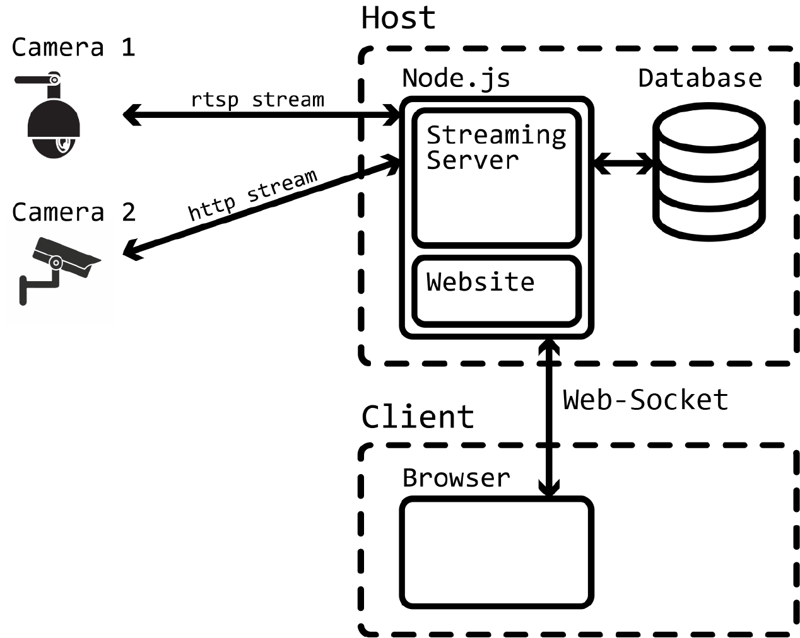

= video-analyser

=== Lorenz Gruber, Simon Ittensammer, Simon Zweimüller
---

== Project Description
Stream the recordings from different cameras to the same interface. +
Save images, which can be viewed on the interface, when the motion sensor triggers. +
Give the user the possibility to add objects, like text, images or the current time to the stream.

== Use Case Diagram
image::images/use_case_diagram.PNG[use case diagram]

== System Architecture

////
== Classdiagram for Entities
image::images/entities_cld.jpg[cld entities]
////
